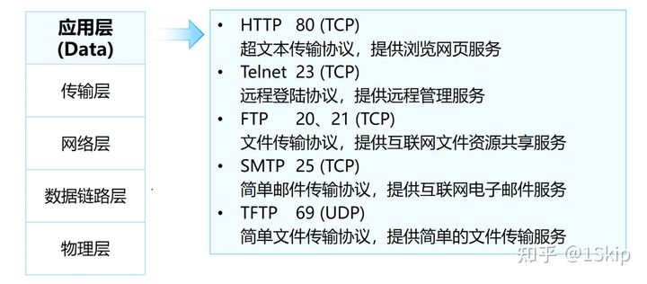
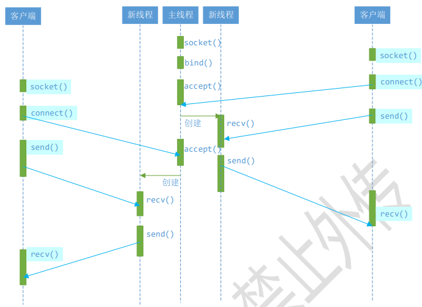
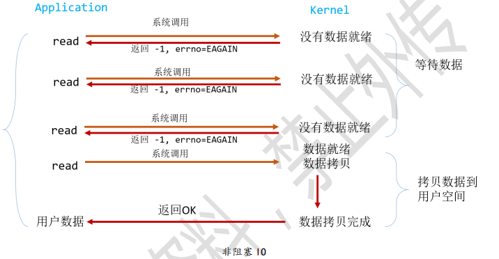

## 网络编程基础
#### 局域网和广域网

    局域网：局域网将一定区域内的各种计算机、外部设备和数据库连接起来形成计算机通信的私有网络。
    广域网：又称广域网、外网、公网。是连接不同地区局域网或城域网计算机通信的远程公共网络。

#### IP（Internet Protocol）
本质是一个整形数，用于表示计算机在网络中的地址。IP 协议版本有两个：IPv4 和 IPv6

    IPv4（Internet Protocol version4）：
        使用一个 32 位的整形数描述一个 IP 地址，4 个字节，int 型
        也可以使用一个点分十进制字符串描述这个 IP 地址： 192.168.247.135
        分成了 4 份，每份 1 字节，8bit（char），最大值为 255
            0.0.0.0 是最小的 IP 地址
            255.255.255.255 是最大的 IP 地址
        按照 IPv4 协议计算，可以使用的 IP 地址共有 232 个(稀缺资源)

    IPv6（Internet Protocol version6）：
        使用一个 128 位的整形数描述一个 IP 地址，16 个字节
        也可以使用一个字符串描述这个 IP 地址：2001:0db8:3c4d:0015:0000:0000:1a2f:1a2b
        分成了 8 份，每份 2 字节，每一部分以 16 进制的方式表示
        按照 IPv6 协议计算，可以使用的 IP 地址共有 2128 个
#### 端口

端口的作用是定位到主机上的某一个进程，通过这个端口进程就可以接受到对应的网络数据了。
比如：在电脑上运行了微信和 QQ, 小明通过客户端给我的的微信发消息，电脑上的微信就收到了消息，为什么？
运行在电脑上的微信和 QQ 都绑定了不同的端口。  
端口是Unsigned short整形数，取值范围0~65536
#### OSI七层网络模型与TCP/IP四层模型

物理层：负责最后将信息编码成电流脉冲或其它信号用于网上传输   
数据链路层:数据链路层通过物理网络链路供数据传输。规定了 0 和 1 的分包形式，确定了网络数据包的形式；  
网络层:网络层负责在源和终点之间建立连接；此处需要确定计算机的位置，通过 IPv4，IPv6 格式的 IP 地址来找到对应的主机 **IP、ICMP协议**  
传输层:传输层向高层提供可靠的端到端的网络数据流服务。每一个应用程序都会在网卡注册一个端口号，该层就是端口与端口的通信 **tcp、udp协议**  
会话层:会话层建立、管理和终止表示层与实体之间的通信会话；建立一个连接（自动的手机信息、自动的网络寻址）;  
表示层:对应用层数据编码和转化，确保以一个系统应用层发送的信息 可以被另一个系统应用层识别；  
应用层:为操作系统或网络应用程序提供访问网络服务的接口。  **FTP、HTTP、TelNet**
#### 网络协议
定义：计算机网络中互相通信的对等实体之间交换信息时所必须遵守的规则的集合
 TCP示意图。
## Socket套接字通信
套接字对应程序猿来说就是一套网络通信的接口，使用这套接口就可以完成网络通信。网络通信的主体主要分为两部分：客户端和服务器端。在客户端和服务器通信的时候需要频繁提到三个概念：IP、端口、通信数据。  
#### 字节序
大于一个字节的数字的存储顺序，如int,long;  
主机字节序：**小端：**  
数据的低位字节存储到内存的低地址位 , 数据的高位字节存储到内存的高地址位（我们的默认情况）  
网络字节序：**大端**  
套接字通信过程中操作的数据都是大端存储的，包括：接收/发送的数据、IP地址、端口  
```c
#include <arpa/inet.h>
```
主机字节序到网络字节序的转换函数：htons、htonl；从网络字节序到主机字节序的转换函数：ntohs、ntohl  
#### IP地址转换  
IP使用过程中都是通过字符串来描述。通过虽然 IP 地址本质是一个整形数，但是在使用的过程中都是通过一个字符串来描述，下面的函数描述了如何将一个字符串类型的 IP 地址进行大小端转换：
int inet_pton(int af, const char *src, void *dst);  
小端字符串->大端整形  
// 将大端的整形数, 转换为小端的点分十进制的IP地址          
const char *inet_ntop(int af, const void *src, char *dst, socklen_t size);
#### sokect addr数据结构

```c
// 在写数据的时候不好用
struct sockaddr {
	sa_family_t sa_family;       // 地址族协议, ipv4
	char        sa_data[14];     // 端口(2字节) + IP地址(4字节) + 填充(8字节)
}
```
#### 套接字函数
int socket(int domain, int type, int protocol);创建套接字  
函数的返回值是一个文件描述符，通过这个文件描述符可以操作内核中的某一块内存，网络通信是基于这个文件描述符来完成的。  
```c
// 将文件描述符和本地的IP与端口进行绑定   
int bind(int sockfd, const struct sockaddr *addr, socklen_t addrlen);
// 给监听的套接字设置监听
int listen(int sockfd, int backlog);
// 等待并接受客户端的连接请求, 建立新的连接, 会得到一个新的文件描述符(通信的)		
int accept(int sockfd, struct sockaddr *addr, socklen_t *addrlen);
//    返回值：函数调用成功，得到一个文件描述符，用于和建立连接的这个客户端通信，调用失败返回 -1.
//    这个函数是一个阻塞函数，当没有新的客户端连接请求的时候，该函数阻塞；当检测到有新的客户端连接请求时，阻塞解除，新连接就建立了，得到的返回值也是一个文件描述符，基于这个文件描述符就可以和客户端通信了。
// 接收数据
ssize_t read(int sockfd, void *buf, size_t size);
ssize_t recv(int sockfd, void *buf, size_t size, int flags);
//如果连接没有断开，接收端接收不到数据，接收数据的函数会阻塞等待数据到达
// 数据到达后函数解除阻塞，开始接收数据，当发送端断开连接，接收端无法接收到任何数据，但是这时候就不会阻塞了，函数直接返回0。
```
## TCP通信流程
TCP 是一个面向连接的，安全的，流式传输协议，这个协议是一个传输层协议。  
面向连接：是一个双向连接，通过三次握手完成，断开连接需要通过四次挥手完成  
安全：tcp 通信过程中，会对发送的每一数据包都会进行校验，如果发现数据丢失，会自动重传  
流式传输：发送端和接收端处理数据的速度，数据的量都可以不一致  

### 服务端
创建用于监听的套接字，这个套接字是一个文件描述符  
int lfd = socket();
将得到的监听的文件描述符和本地的 IP 端口进行绑定
bind(); 
设置监听 (成功之后开始监听，监听的是客户端的连接)
listen();
等待并接受客户端的连接请求，建立新的连接，会得到一个新的文件描述符 (通信的)，没有新连接请求就阻塞
int cfd = accept();
通信，读写操作默认都是阻塞的  
// 接收数据  
read(); / recv();  
// 发送数据  
write(); / send();
断开连接，关闭套接字
close();
在 tcp 的服务器端，有两类文件描述符  
 **监听的文件描述符：**    
        只需要有一个  
        不负责和客户端通信，负责检测客户端的连接请求，检测到之后调用 accept 就可以建立新的连接  
**通信的文件描述符：**  
        负责和建立连接的客户端通信  
        如果有 N 个客户端和服务器建立了新的连接，通信的文件描述符就有 N 个，每个客户端和服务器都对应一个通信的文件描述符   


文件描述符对应的内存结构：
一个文件文件描述符对应两块内存, 一块内存是读缓冲区, 一块内存是写缓冲区
读数据: 通过文件描述符将内存中的数据读出, 读缓冲区  
写数据: 通过文件描述符将数据写入到某块内存中, 写缓冲区  

    监听的文件描述符:
        客户端的连接请求会发送到服务器端监听的文件描述符的读缓冲区中
        读缓冲区中有数据，说明有新的客户端连接
        调用 accept () 函数，这个函数会检测监听文件描述符的读缓冲区
            检测不到数据，该函数阻塞
            如果检测到数据，解除阻塞，新的连接建立

    通信的文件描述符:
        客户端和服务器端都有通信的文件描述符
        发送数据：调用函数 write () /send ()，数据进入到内核中
            数据并没有被发送出去，而是将数据写入到了通信的文件描述符对应的写缓冲区中
            内核检测到通信的文件描述符写缓冲区中有数据，内核会将数据发送到网络中
        接收数据：调用的函数 read () /recv (), 从内核读数据
            数据如何进入到内核程序猿不需要处理，数据进入到通信的文件描述符的读缓冲区中
            数据进入到内核，必须使用通信的文件描述符，将数据从读缓冲区中读出即可
### 客户端的通信流程
在单线程的情况下客户端通信的文件描述符有一个，没有监听的文件描述符  
创建一个通信的套接字  
int cfd = socket();  
连接服务器，需要知道服务器绑定的 IP 和端口  
connect();  
通信  
// 接收数据  
read(); / recv();  
// 发送数据  
write(); / send();  
断开连接，关闭文件描述符 (套接字)  
_**扩展**_：在windows下也有一套soket编程的API，和windows下类似。


