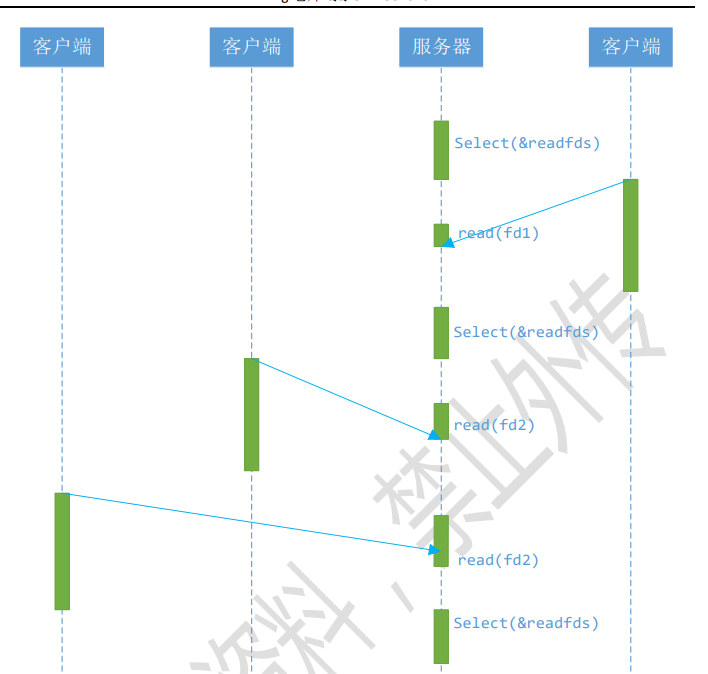

网络 IO，会涉及到两个系统对象，一个是用户空间调用IO的进程或者线程，另一个是内核
空间的内核系统，比如发生 IO 操作 read 时，它会经历两个阶段：
1. 等待数据准备就绪
2. 将数据从内核拷贝到进程或者线程中。     
因为在以上两个阶段上各有不同的情况，所以出现了多种网络 IO 模型。
对于服务器端的流程——类似于接电话过程  
socket()[找到一个可以通话的手机]----->bind()[插入一个固定号码]------>listen()[随时准备接听]-------> accept------->recv()------->send()------>close();  
对于客户端的主要流程----类似于打电话过程  
socket()----->connect()------>recv/read/send------>close()
### 阻塞型IO
TCP/IP协议栈复习   
Q1三次握手发生在哪个函数里面？  
服务器调用listen进行监听  
客户端调用connect来发送syn报文  
服务器协议栈负责三次握手的交互过程。连接建立后，往listen队列中添加一个成功的连接，直到队列的最大长度。  
服务器调用accept从listen队列中取出一条成功的tcp连接，listen队列中的连接个数就少一个  
总结一下就是：  

   TCP的三次握手是有客户端调用connect()函数以及服务器端的协议栈共同完成的。   
   服务器端的listen函数负责监听客户端的连接请求，并维护一个listen队列，当有客户端连接成功时，就把它放在listen队列里。   
   accept()函数负责查看listen队列里面有没有成功连接，如果有则从队列中取出，没有则阻塞（直到获得一个成功连接返回）。它每取出一个成功连接，就会生成一个对应的accept fd，用于唯一标识该连接成功的客户端。  


   listen函数会把sockfd的套接字标记为被动的监听listen状态，之后服务端与客户端通信的整个流程中sockfd只有listen和closed两种状态，第二个参数backlog代表等待队列的最大长度。  
   当客户端connect时，服务器处于listen状态就可以accept，在协议栈里面进行三次握手，这一过程与应用层无关。
   当客户端connect来到时，服务端进入SYN_RCVD状态并给予SYN＋ACK响应。当下次客户端完成三次握手，收到客户端的ACK时：如果队列中有空间，则服务端的连接也建立成功，否则服务端眼里没有成功。每建立成功一次，要往队列中放入刚才建立好的连接，也就是队列空间－1，服务端状态从SYN_RCVD变为ESTABLISHED，如果不成功还是原来的SYN_RCVD状态。当服务端调用accept成功时，又是队列空间＋1，从队列中拿走一个连接。  
   在客户端执行connect的时候，便是向已经listen的服务器发出三次握手，等connect返回的时候，三次握手已经完成，和accept没有任何关系。  
多线程服务器  

```c
	while (1) {

		struct sockaddr_in client;
	    socklen_t len = sizeof(client);
	    if ((connfd = accept(listenfd, (struct sockaddr *)&client, &len)) == -1) {
	        printf("accept socket error: %s(errno: %d)\n", strerror(errno), errno);
	        return 0;
	    }

		pthread_t threadid;
		pthread_create(&threadid, NULL, client_routine, (void*)&connfd);
    }
    void *client_routine(void *arg) { //
         int connfd = *(int *)arg;
        char buff[MAXLNE];
    while (1) {
     int n = recv(connfd, buff, MAXLNE, 0);
    if (n > 0) {
    buff[n] = '\0';
    printf("recv msg from client: %s\n", buff);
    send(connfd, buff, n, 0);
    } else if (n == 0) {
    close(connfd);
    break;
}
}
return NULL;
}
```
很多初学者可能不明白为何一个 socket 可以 accept 多次。实际上 socket 的设计者
可能特意为多客户机的情况留下了伏笔，让 accept()能够返回一个新的 socket。下面是
accept 接口的原型：
int accept(int s, struct sockaddr *addr, socklen_t *addrlen);  
输入参数 s 是从 socket()，bind()和 listen()中沿用下来的 socket 句柄值。执行完
bind()和 listen()后，操作系统已经开始在指定的端口处监听所有的连接请求，如果有请
求，则将该连接请求加入请求队列。调用 accept()接口正是从 socket s 的请求队列抽
取第一个连接信息，创建一个与 s 同类的新的 socket 返回句柄。新的 socket 句柄即是后
续 read()和 recv()的输入参数。如果请求队列当前没有请求，则 accept() 将进入阻塞
状态直到有请求进入队列。  
### 非阻塞型IO

从图中可以看出，当用户进程发出 read 操作时，如果 kernel 中的数据还没有准备好，那
么它并不会 block 用户进程，而是立刻返回一个 error。从用户进程角度讲 ，它发起一个
read 操作后，并不需要等待，而是马上就得到了一个结果。用户进程判断结果是一个 error
时，它就知道数据还没有准备好，于是它可以再次发送 read 操作。一旦 kernel 中的数据
准备好了，并且又再次收到了用户进程的 system call，那么它马上就将数据拷贝到了用
户内存，然后返回，所以，在非阻塞式 IO 中，用户进程其实是需要不断的主动询问 kernel
数据准备好了没有。
### IO多路复用
select/epoll 的好处就在于单
个 process 就可以同时处理多个网络连接的 IO。它的基本原理就是 select/epoll 这个 function
会不断的轮询所负责的所有 socket，当某个 socket 有数据到达了，就通知用户进程。  

当用户进程调用了 select，那么整个进程会被 block，而同时，kernel 会“监视”所
有 select 负责的 socket，当任何一个 socket 中的数据准备好了，select 就会返回。这
个时候用户进程再调用 read 操作，将数据从 kernel 拷贝到用户进程。  
**一个服务员集中处理多桌模型**  
这个图和 blocking IO 的图其实并没有太大的不同，事实上还更差一些。因为这里需
要使用两个系统调用(select 和 read)，而 blocking IO 只调用了一个系统调用(read)。
但是使用 select 以后最大的优势是用户可以在一个线程内同时处理多个 socket 的 IO 请
求。用户可以注册多个 socket，然后不断地调用 select 读取被激活的 socket，即可达到
在同一个线程内同时处理多个 IO 请求的目的。而在同步阻塞模型中，必须通过多线程的方
式才能达到这个目的。  
（多说一句：所以，如果处理的连接数不是很高的话，使用
select/epoll 的 web server 不一定比使用 multi-threading + blocking IO 的 web
server 性能更好，可能延迟还更大。select/epoll 的优势并不是对于单个连接能处理得
更快，而是在于能处理更多的连接。）  
int nready = select(max_fd+1, &rset, NULL, NULL, NULL);  
函数原型
```c
int select(int nfds, fd_set *readfds, fd_set *writefds, fd_set 
*exceptfds,
struct timeval *timeout)
```
fd_set 类型可以简单的理解为按 bit 位标记句柄的队列，例如要在某 fd_set
中标记一个值为 16 的句柄，则该 fd_set 的第 16 个 bit 位被标记为 1。具体的置位、验证
可使用 FD_SET、FD_ISSET 等宏实现。在 select()函数中，readfds、writefds 和
exceptfds 同时作为输入参数和输出参数。  
 
fd_set集合可以通过一些宏由人为来操作，比如清空集合FD_ZERO(fd_set* ）；将一个给定的文件描述符加入集合之中FD_SET(int,fd_set*）；将一个给定的文件描述符从集合中删除FD_CLR(int，fd_set*）；检查集合中指定的文件描述符是否可以读写FD_ISSET(int,fd_set*)  

  

如果输入的 readfds 标记了 16 号句柄，则
select()将检测 16 号句柄是否可读。在 select()返回后，可以通过检查 readfds 有否标
记 16 号句柄，来判断该“可读”事件是否发生。另外，用户可以设置 timeout 时间。   
timeout是select的超时时间，这个参数至关重要，它可以使select处于三种状态，第一，若将NULL以形参传入，即不传入时间结构，就是将select置于阻塞状态，一定等到监视文件描述符集合中某个文件描述符发生变化为止；第二，若将时间值设为0秒0毫秒，就变成一个纯粹的非阻塞函数，不管文件描述符是否有变化，都立刻返回继续执行，文件无变化返回0，有变化返回一个正值；第三，timeout的值大于0，这就是等待的超时时间，即select在timeout时间内阻塞，超时时间之内有事件到来就返回了，否则在超时后不管怎样一定返回，返回值同上述。  


上述模型只是描述了使用 select()接口同时从多个客户端接收数据的过程；由于 select()
接口可以同时对多个句柄进行读状态、写状态和错误状态的探测，所以可以很容易构建为多
个客户端提供独立问答服务的服务器系统  
这里需要指出的是，客户端的一个 connect() 操作，将在服务器端激发一个“可读事
件”，所以 select() 也能探测来自客户端的 connect() 行为。   
上述模型中，最关键的地方是如何动态维护 select()的三个参数 readfds、writefds
和 exceptfds。作为输入参数，readfds 应该标记所有的需要探测的“可读事件”的句柄，
其中永远包括那个探测 connect() 的那个“母”句柄；同时，writefds 和 exceptfds 应
该标记所有需要探测的“可写事件”和“错误事件”的句柄 ( 使用 FD_SET() 标记 )。
作为输出参数，readfds、writefds 和 exceptfds 中的保存了 select() 捕捉到的
所有事件的句柄值。程序员需要检查的所有的标记位 ( 使用 FD_ISSET()检查 )，以确定
到底哪些句柄发生了事件。  
  
上述模型主要模拟的是“一问一答”的服务流程，所以如果 select()发现某句柄捕捉到
了“可读事件”，服务器程序应及时做recv()操作，并根据接收到的数据准备好待发送数据，
并将对应的句柄值加入 writefds，准备下一次的“可写事件”的 select()探测。同样，如
果 select()发现某句柄捕捉到“可写事件”，则程序应及时做 send()操作，并准备好下一
次的“可读事件”探测准备。  

这种模型的特征在于每一个执行周期都会探测一次或一组事件，一个特定的事件会触发
某个特定的响应。我们可以将这种模型归类为“事件驱动模型”。  

相比其他模型，使用 select() 的事件驱动模型只用单线程（进程）执行，占用资源
少，不消耗太多 CPU，同时能够为多客户端提供服务。如果试图建立一个简单的事件驱动的
服务器程序，这个模型有一定的参考价值。  
poll将用户传入的数组拷贝到内核空间，然后查询每个fd对应的设备状态， 但是它没有最大连接数的限制，原因是它是基于链表来存储的  
### epoll 

epoll精巧的使用了3个方法来实现select方法要做的事：

    新建epoll描述符==epoll_create()
    epoll_ctrl(epoll描述符，添加或者删除所有待监控的连接)
    返回的活跃连接 ==epoll_wait（ epoll描述符）
与select相比，epoll分清了频繁调用和不频繁调用的操作。例如，epoll_ctrl是不太频繁调用的，而epoll_wait是非常频繁调用的。这时，epoll_wait却几乎没有入参，这比select的效率高出一大截，而且，它也不会随着并发连接的增加使得入参越发多起来，导致内核执行效率下降。  
poll是通过内核与用户空间mmap同一块内存实现的。mmap将用户空间的一块地址和内核空间的一块地址同时映射到相同的一块物理内存地址（不管是用户空间还是内核空间都是虚拟地址，最终要通过地址映射映射到物理地址），使得这块物理内存对内核和对用户均可见，减少用户态和内核态之间的数据交换。内核可以直接看到epoll监听的句柄，效率高。
红黑树将存储epoll所监听的套接字。上面mmap出来的内存如何保存epoll所监听的套接字，必然也得有一套数据结构，epoll在实现上采用红黑树去存储所有套接字，当添加或者删除一个套接字时（epoll_ctl），都在红黑树上去处理，红黑树本身插入和删除性能比较好，时间复杂度O(logN)  
通过epoll_ctl函数添加进来的事件都会被放在红黑树的某个节点内，所以，重复添加是没有用的。当把事件添加进来的时候时候会完成关键的一步，那就是该事件都会与相应的设备（网卡）驱动程序建立回调关系，当相应的事件发生后，就会调用这个回调函数，该回调函数在内核中被称为：ep_poll_callback,这个回调函数其实就所把这个事件添加到rdllist这个双向链表中。一旦有事件发生，epoll就会将该事件添加到双向链表中。那么当我们调用epoll_wait时，epoll_wait只需要检查rdlist双向链表中是否有存在注册的事件，效率非常可观。这里也需要将发生了的事件复制到用户态内存中即可。  
```c
    int epfd = epoll_create(1); //int size
	struct epoll_event events[POLL_SIZE] = {0};
	struct epoll_event ev;
	ev.events = EPOLLIN;
	ev.data.fd = listenfd;
	epoll_ctl(epfd, EPOLL_CTL_ADD, listenfd, &ev);
```
epoll_create: 用来创建一个epoll文件描述符  
epoll_ctl: 用来添加/修改/删除需要侦听的文件描述符及其事件  
epoll_wait:接收发生在被侦听的描述符上的，用户感兴趣的IO事件   
函数说明：
```c
int epoll_ctl(int epfd, int op,int fd,struct epoll_event * event);
//events  成员变量可以是以下几个宏的集合：EPOLLIN ：表示对应的文件描述符可以读（包括对端SOCKET正常关闭）；
//EPOLLOUT：表示对应的文件描述符可以写；
//EPOLLPRI：表示对应的文件描述符有紧急的数据可读（这里应该表示有带外数据到来）；
//EPOLLERR：表示对应的文件描述符发生错误； EPOLLHUP：表示对应的文件描述符被挂断；
//EPOLLET： 将EPOLL设为边缘触发(Edge Triggered)模式，这是相对于水平触发(Level Triggered)来说的。
//EPOLLONESHOT：只监听一次事件，当监听完这次事件之后，如果还需要继续监听这个socket的话，需要再次把这个socket加入到EPOLL队列里。
//返回值：成功时，epoll_ctl（）返回零。发生错误时，epoll_ctl（）返回-1并正确设置了errno。
/*********************
epfd： 等待的监听描述符，也就是哪个池子中的内容
*events： 指针，指向epoll_event的数组，监听描述符中的连接描述符就绪后，将会依次将信息填入
maxevents： 最多返回最大事件
timeout： 等待时间，要是有连接描述符就绪，立马返回，如果没有，timeout时间后也返回，单位是ms
epoll_wait()将会一直阻塞直到：epfd产生事件 / 被信号处理函数打断 / 超时。
*********************/
int epoll_wait（int epfd，struct epoll_event * events， int maxevents，int timeout）;
```
